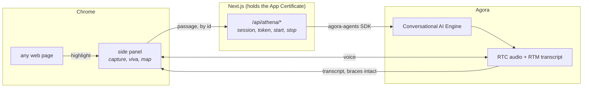

# Athena

**Highlight anything you don't understand. Get examined on it, out loud, by
someone who has already read it.**

[](../../LICENSE)
[](https://nodejs.org/)
[](https://developer.chrome.com/docs/extensions/mv3/intro/)
[](https://docs.agora.io/en/conversational-ai/overview/product-overview)

> **Copyable prompt for coding agents**
>
> Build and run the Athena recipe. Read `docs/ai/RECIPE.md` and
> `quickstart/AGENTS.md` fully before touching anything. Run
> `cd quickstart && pnpm install && pnpm dev`, then load `extension/` unpacked
> at `chrome://extensions`. Paste two paragraphs into the side panel and start a
> viva. The one thing you must not break is the curly-brace control channel:
> `MiniMaxTTS({ skipPatterns: [5] })` in
> `quickstart/app/api/athena/start/route.ts` is what keeps the JSON payload out
> of the speech synthesiser. Remove it and the agent reads its own telemetry
> aloud.

---

## What you build

A Chrome extension that turns any passage on any web page into a live spoken
examination.

You highlight three paragraphs about database normalisation. Athena reads them,
tells you in two sentences what they actually cover, and asks if you want to be
tested or want something explained first. Then she starts asking. One question
at a time, adapting: nail an answer and the next one gets harder, fumble one and
she narrows in on exactly the bit you missed, say "I have no idea" and she stops
examining and teaches it, then checks that it landed.

While this happens, a row of chips on screen fills in with every topic she has
decided to cover, colour-coded by how you are doing. Ask her something the
passage does not cover and she says so out loud instead of bluffing, and the
thing you asked about appears on screen labelled as off-passage.

At the end you get a summary of what was solid, what you recovered, and what to
revise, plus a bubble map of the whole session. Every session is saved locally
and folded into one revision list ranked by how much each topic still needs
work, so you can come back a week later and be re-examined on just the parts you
never got.

**The interesting part is how the chips work, and it costs zero extra API
calls.**

## The trick: one channel, two audiences

Every voice agent that wants to drive a UI hits the same wall. The model is
producing speech. You want structured data. The obvious answers are all bad:
a second model call to classify what just happened (slow, expensive, and now
you have two sources of truth), tool calling (a round trip mid-turn, and the
turn stalls while it happens), or a separate text channel (which the speech
pipeline has no reason to stay in sync with).

Agora's ConvoAI join payload has a field that solves this for free.
[`tts.skip_patterns`](https://docs-md.agora.io/en/conversational-ai/rest-api/agent/join.md)
tells the engine to strip matching spans before they reach the speech
synthesiser. Pattern `5` is curly braces. Crucially, the **real-time transcript
still carries the full untouched text**.

So braces become a private side channel running down the voice pipeline you
already have.

```
LLM writes:  "Good. So what does that cost you on writes?
              {"mark":{"topic":"Normalization","result":"correct"},
               "focus":"Indexing"}"

You hear:    "Good. So what does that cost you on writes?"

App reads:   the payload, flips the Normalization chip green,
             and lights up Indexing as the active question
```

One model. One call. One round trip. The speech and the state can never
disagree, because they are the same tokens.

The contract the model is held to lives in
[`quickstart/lib/athena/prompt.ts`](../../quickstart/lib/athena/prompt.ts), the
reader that pulls the payload back out is
[`quickstart/lib/athena/parse.ts`](../../quickstart/lib/athena/parse.ts), and it
is covered by 21 assertions in
[`quickstart/scripts/athena-parse.test.ts`](../../quickstart/scripts/athena-parse.test.ts).

The parser earns those tests. It walks backwards from the last `}` and lets
`JSON.parse` decide which `{` opened the payload, because tracking quote state
does not survive contact with real prose: an apostrophe in "the index's cost"
flips the parity and hides the JSON completely. When a payload is malformed or
missing, a chip lags one turn. Nothing crashes.

## Architecture



Three things are worth knowing about why it is shaped this way.

**The backend exists for exactly one reason.** An extension is readable by
anyone who installs it, so the App Certificate cannot live there. The Next.js
app signs RTC and RTM tokens and authenticates the ConvoAI REST calls. That is
its whole job.

**The passage travels by id, never in a URL.** A highlighted passage runs to
thousands of characters. The panel POSTs it and gets back an eight-character
session id.

**The viva runs on the extension's own origin, not in an iframe.** The first
version embedded the Next.js page in a frame and the microphone never worked
once: a cross-origin frame inside a `chrome-extension://` page is its own
permission context, so Chrome will not inherit a grant given to
`localhost:3000`, and the prompt it raises comes back as
`NotAllowedError: Permission dismissed`. Vendoring the Agora web SDKs into
[`extension/vendor/`](../../extension/vendor/) removes the frame and the problem
with it. Full diagrams and the call sequence are in
[`docs/architecture.md`](../architecture.md).

## Prerequisites

- [Node.js 22+](https://nodejs.org/)
- **pnpm 10 specifically.** pnpm 11 turns the sample's harmless
  `ERR_PNPM_IGNORED_BUILDS` warning into a hard install failure.
- [Agora CLI](https://github.com/AgoraIO/cli), the fastest way to get an App ID
  and App Certificate
- Google Chrome, with a working microphone

You do **not** need a Deepgram key, an OpenAI key, or a MiniMax key. Speech
recognition, the model and the voice are all resold through Agora and billed on
one account. Two environment variables is the whole setup.

## Run it

```bash
# 1. Get Agora credentials into place
agora login
agora project create athena --feature rtc --feature rtm --feature convoai
agora project use athena
agora project env write quickstart/.env.local

# 2. Start the backend
cd quickstart
pnpm install
pnpm dev                      # http://localhost:3000
```

Then load the extension:

1. Open `chrome://extensions`
2. Turn on **Developer mode** (top right)
3. **Load unpacked**, and pick the [`extension/`](../../extension/) folder
4. Click the Athena icon

Paste a couple of paragraphs into the panel, or highlight text on any page and
click the icon to pre-fill it, then press **Start viva**.

The first run opens a tab asking for your microphone. Chrome grants microphone
access per origin, and the panel needs the grant on the extension's own origin,
so this happens once and then never again.

## Verify it works

1. Paste 200-ish words on any technical topic. Athena's first turn should
   **orient** you, two or three sentences on what the material covers, then ask
   whether to begin. She should **not** open with a question.
2. The chip row should populate with 4 to 6 topics the moment she finishes that
   first turn.
3. Say "test me". Her very next words should be an examination question, with no
   preamble.
4. Answer one well. That chip goes green and a new one lights up.
5. Answer one badly, or say "I don't know". She explains it, marks the chip red,
   moves on, and **comes back to it later phrased differently**. Getting it right
   on the second pass flips it green and marks it recovered.
6. Ask her something the passage does not cover. She should decline out loud
   rather than answer from general knowledge, and the thing you asked about
   should appear on screen under "not in this passage".
7. Talk over her mid-sentence. She stops.
8. End the session. You get a summary with a bubble map, downloadable as
   markdown with the transcript.
9. **You should never hear a curly brace, a JSON key, or the word "focus".** If
   you do, `skipPatterns` is not reaching the engine.

Automated checks, none of which need Agora credentials:

```bash
cd quickstart
pnpm lint
pnpm typecheck
pnpm verify:api
node --import tsx scripts/athena-parse.test.ts    # 21 assertions
```

## Environment variables

| Variable | Required | Notes |
| --- | :---: | --- |
| `NEXT_PUBLIC_AGORA_APP_ID` | yes | Agora Console → your project → App ID |
| `NEXT_AGORA_APP_CERTIFICATE` | yes | Same page. Server-side only, never shipped to a client |
| `ATHENA_ALLOWED_ORIGINS` | on deploy | Comma-separated CORS allowlist. Blank in development, where any `chrome-extension://` or loopback origin is accepted. A production build with this unset refuses every cross-origin caller |

`agora project env write quickstart/.env.local` writes the first two for you.
Template in
[`quickstart/env.local.example`](../../quickstart/env.local.example).

## Commands

```bash
pnpm doctor       # prerequisite and credential check
pnpm dev          # http://localhost:3000
pnpm lint
pnpm typecheck
pnpm verify:api   # route contract checks
pnpm build
pnpm verify       # all of the above, in order
```

## Make it yours

Athena is a viva examiner, but the machinery underneath is "a voice agent that
drives a live UI without a second model call". Swap the prompt and it becomes
something else entirely.

| You want to change | Edit |
| --- | --- |
| What kind of examiner she is, or the control payload schema | [`quickstart/lib/athena/prompt.ts`](../../quickstart/lib/athena/prompt.ts) |
| How payloads are read and applied to state | [`quickstart/lib/athena/parse.ts`](../../quickstart/lib/athena/parse.ts) |
| Voice, model, speech recognition, turn detection | [`quickstart/app/api/athena/start/route.ts`](../../quickstart/app/api/athena/start/route.ts) |
| The map, transcript and controls | [`extension/sidepanel.js`](../../extension/sidepanel.js), [`extension/sidepanel.css`](../../extension/sidepanel.css) |
| RTC and RTM lifecycle inside the panel | [`extension/viva.js`](../../extension/viva.js) |
| Where the backend lives | [`extension/config.js`](../../extension/config.js), plus `host_permissions` in [`extension/manifest.json`](../../extension/manifest.json) |

Three things to leave alone unless you know what you are replacing them with:

- `skipPatterns: [5]` on the TTS builder. Without it the control payload is read
  aloud.
- **One brace pair per turn.** The engine skips the first outermost pair only, so
  a second object gets spoken.
- `RtcTokenBuilder.buildTokenWithRtm` for tokens. An RTC-only token does not
  grant RTM, and RTM is how the transcript arrives.

## Deploy

The backend is a stock Next.js app and deploys to Vercel unchanged. Set
`NEXT_PUBLIC_AGORA_APP_ID` and `NEXT_AGORA_APP_CERTIFICATE` in the deployment,
keeping the certificate server-side.

Two extra steps because the client is an extension:

1. **Pin the extension ID** with a `key` in
   [`extension/manifest.json`](../../extension/manifest.json). An unpacked
   extension gets a fresh ID per install path, and an allowlist of an ID that
   changes on every reload is not an allowlist.
2. **Point the extension at the deployment.** Change `SERVER` in
   [`extension/config.js`](../../extension/config.js) *and* add the same origin
   to `host_permissions` in the manifest. Chrome blocks fetches to any host the
   manifest does not declare, and changing one without the other fails at
   runtime as an opaque network error.

Then set `ATHENA_ALLOWED_ORIGINS=chrome-extension://<your pinned id>` on the
deployment.

## Non-goals

- **Grading.** Athena is a study aid and says so on screen throughout. She can
  examine what you give her and tell you where you are weak. She cannot award a
  mark, and she will not judge material outside the passage.
- **Multi-speaker.** One student, one agent, English.
- **A durable session backend.** Sessions live in an in-memory `Map` with a six
  hour TTL and do not survive a restart. That is deliberate: a viva is one person
  on one machine for a few minutes. Your revision history *does* persist, in
  `chrome.storage.local`, on your own machine.
- **Web Store distribution.** Load it unpacked.

## Known limitations

- Speech recognition mishears acronyms, so a correct answer can be transcribed
  into a wrong one. `gpt-4o-mini` can also accept a fluent but empty answer.
- The control channel depends on model compliance. The parser is deliberately
  tolerant, so a dropped payload means a chip lags a turn rather than a crash.
- Highlight capture does not work on `chrome://` pages or in the built-in PDF
  viewer, because extensions cannot inject there. Pasting always works.
- The passage is truncated at 6000 characters before it reaches the prompt.
