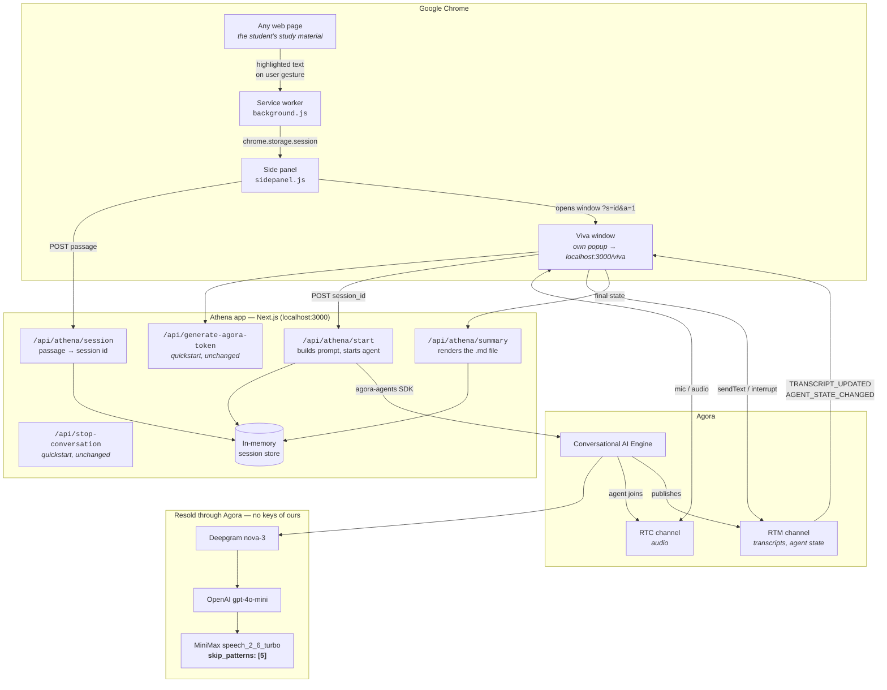
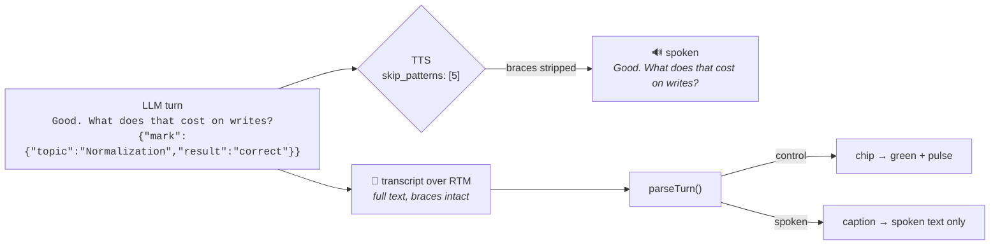

# Athena — system architecture

## Components



## Why the pieces sit where they do

**The App Certificate never leaves the server.** It signs RTC and RTM tokens and authenticates ConvoAI REST calls. A Chrome extension is readable by anyone who installs it, so the Next.js app is the trust boundary. This is why a backend is structural here, not optional.

**The extension captures, the app converses.** Selection capture needs `activeTab`, granted only on a user gesture, so it happens in the service worker at click time. Everything voice-related stays in the app, which already contains the official quickstart's correctness work — StrictMode-safe join, microphone track lifecycle, RTM identity matching the token subject, transcript UID remapping.

**The passage travels by id, not by URL.** A highlighted passage runs to thousands of characters, past what is safe in a query string. The extension POSTs it and passes an 8-character id.

**The viva gets its own window, and this is not a stylistic choice.** It was embedded in the side panel first. A cross-origin frame inside a `chrome-extension://` page is a separate microphone permission context — Chrome neither inherits a grant already given to `localhost:3000` nor reliably lets the resulting prompt be answered, returning `NotAllowedError: Permission dismissed`. A top-level window prompts normally and the grant persists. The service worker parks it against the right edge of the browser window so it still sits beside the material.

## Call sequence for one viva

```mermaid
sequenceDiagram
    autonumber
    actor S as Student
    participant SW as Service worker
    participant P as Side panel
    participant A as Athena app
    participant E as ConvoAI Engine
    participant C as RTC + RTM

    S->>SW: highlights a passage, clicks the icon
    SW->>SW: executeScript → window.getSelection()
    SW->>P: stash in chrome.storage.session, open panel
    P->>A: POST /api/athena/session {passage}
    A-->>P: {session_id}
    P->>SW: open window /viva?s=session_id&a=1
    SW->>A: window opens, viva auto-starts

    A->>A: GET /api/generate-agora-token
    par
        A->>E: POST /join — Athena prompt, skipPatterns [5]
        E-->>A: {agent_id, RUNNING}
    and
        A->>C: RTM login + subscribe
    end
    A->>C: RTC join + publish microphone
    E->>C: agent joins the channel
    E->>S: greeting (TTS)

    A->>C: sendText "[athena:system] begin"
    Note over E: Athena picks 4–6 topics from the passage
    E->>C: "…first question… {topics:[…],focus:'…'}"
    C->>A: TRANSCRIPT_UPDATED (full text, braces intact)
    Note over A: TTS spoke only the question —<br/>skip_patterns stripped the braces
    A->>A: parse → render chips

    loop each exchange
        S->>C: spoken answer
        E->>C: "…next question… {focus:…, mark:{topic,result}}"
        C->>A: TRANSCRIPT_UPDATED
        A->>A: chip flips — green / amber, with a pulse
    end

    Note over E,S: Athena returns to an amber topic;<br/>a correct answer flips it green — the recovery beat

    S->>A: "End viva"
    A->>E: POST /stop-conversation
    A->>A: POST /api/athena/summary → downloadable .md
```

## The silent control channel



Per the [join endpoint spec](https://docs-md.agora.io/en/conversational-ai/rest-api/agent/join.md), `skip_patterns` value `5` skips content in curly braces, and the real-time transcript *"restores the complete text after each sentence finishes."* The student hears one thing; the app sees both.

**Only one brace pair per turn is requested.** The engine documents that it skips *"the first outermost bracket pair"*, so a second object in the same turn risks being read aloud. The prompt enforces one object; the parser takes the last complete span if the model disobeys.

## Token model

Both tokens come from the quickstart's unmodified `/api/generate-agora-token`, built with `RtcTokenBuilder.buildTokenWithRtm` — one credential covering RTC and RTM.

| Identity | Token subject | Notes |
|---|---|---|
| Student (browser) | `uid` from the token response | RTM must log in with **this exact identity** — a mismatch surfaces as a generic "failed to start conversation" |
| Athena (agent) | `agent_rtc_uid` = `"123456"` (string) | `remoteUids` restricts her to the student's audio only |

Renewal on `token-privilege-will-expire` fetches RTC and RTM tokens in parallel and renews both.

## Failure modes and what the student sees

| Failure | Behaviour |
|---|---|
| Athena app not running | Panel: "Athena server is not reachable", with the command to start it |
| Page cannot be injected (`chrome://`, PDF viewer, Web Store) | Panel explains why and suggests the right-click menu |
| Selection too short | Panel states the minimum and asks for more |
| Session expired | Viva page asks the student to re-highlight |
| Agent fails to join | Error with a retry button; nothing hangs |
| Pipeline error mid-viva | `AGENT_ERROR` / `MESSAGE_ERROR` render in an alert strip; the session continues |
| Token renewal fails | Warning shown before the session drops |
| Malformed control payload | Dropped silently; the chip updates on the next valid payload |
| Summary generation fails | Session still ends cleanly, with a message |
