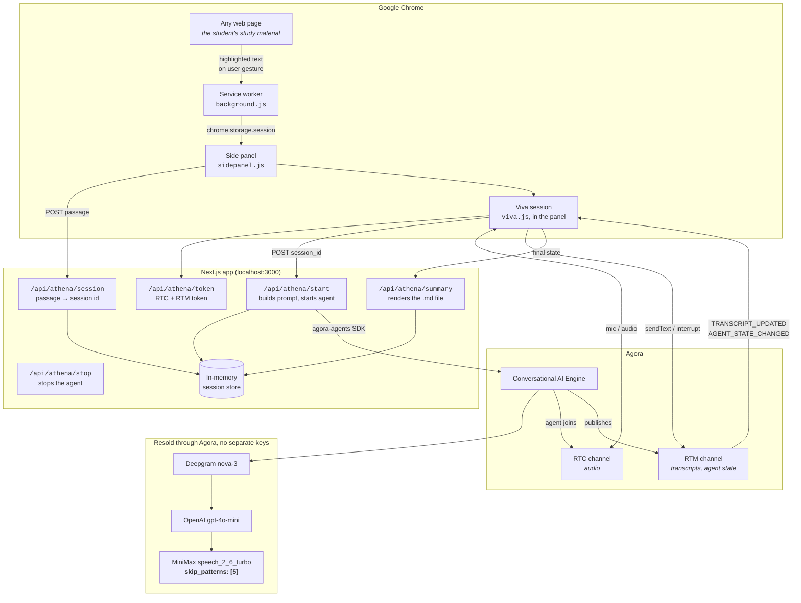
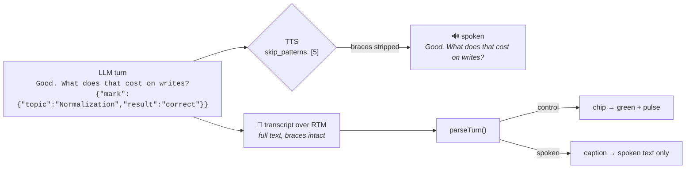

# Athena system architecture

## Components



## Why the pieces sit where they do

**The App Certificate never leaves the server.** It signs RTC and RTM tokens and authenticates the ConvoAI REST calls. A Chrome extension is readable by anyone who installs it, so the Next.js app is the trust boundary. That's why there's a backend at all.

**Capture happens in the service worker.** Reading the selection needs `activeTab`, which is only granted on a user gesture, so it has to happen at click time in the worker. The panel has no access to the page itself.

**The passage travels by id, not in the URL.** A highlighted passage runs to thousands of characters, past what's safe in a query string, so the extension POSTs it and gets back an 8-character id.

**The viva runs in the panel, on the extension's own origin.** The first version embedded the Next.js page in an iframe and the microphone never worked: a cross-origin frame inside a `chrome-extension://` page is its own permission context, so Chrome doesn't inherit a grant given to `localhost:3000`, and the prompt it raises comes back as `NotAllowedError: Permission dismissed`. Vendoring the Agora web SDKs removes the frame. The panel asks for the extension's microphone once, in a normal tab, and keeps it. The page at `/viva` still exists for a standalone tab.

## Call sequence for one viva

```mermaid
sequenceDiagram
    autonumber
    actor S as Student
    participant SW as Service worker
    participant P as Side panel
    participant A as Athena app
    participant E as ConvoAI Engine
    participant C as RTC + RTM

    S->>SW: highlights a passage, clicks the icon
    SW->>SW: executeScript → window.getSelection()
    SW->>P: stash in chrome.storage.session, open panel
    P->>A: POST /api/athena/session {passage}
    A-->>P: {session_id}

    P->>A: GET /api/athena/token
    par
        P->>E: POST /api/athena/start, skipPatterns [5]
        E-->>P: {agent_id, RUNNING}
    and
        P->>C: RTM login + subscribe
    end
    P->>C: RTC join + publish microphone
    E->>C: agent joins the channel
    E->>S: greeting (TTS)

    P->>C: sendText "[athena:system] begin"
    Note over E: Athena picks 4-6 topics from the passage
    E->>C: "…first question… {topics:[…],focus:'…'}"
    C->>P: TRANSCRIPT_UPDATED (full text, braces intact)
    Note over P: TTS spoke only the question;<br/>skip_patterns stripped the braces
    P->>P: parse → render chips

    loop each exchange
        S->>C: spoken answer
        E->>C: "…next question… {focus:…, mark:{topic,result}}"
        C->>P: TRANSCRIPT_UPDATED
        P->>P: chip flips green or amber, with a pulse
    end

    Note over E,S: Athena returns to an amber topic;<br/>a correct answer flips it green

    S->>P: "End viva"
    P->>A: POST /api/athena/stop
    P->>A: POST /api/athena/summary → downloadable .md
```

## The control channel



Per the [join endpoint spec](https://docs-md.agora.io/en/conversational-ai/rest-api/agent/join.md), `skip_patterns` value `5` skips content in curly braces, and the real-time transcript *"restores the complete text after each sentence finishes."* The student hears one thing, the app sees both.

Only one brace pair per turn is asked for. The engine skips *"the first outermost bracket pair"*, so a second object in the same turn risks being read aloud. The prompt asks for one, and the parser takes the last complete span if the model ignores that.

## Token model

`/api/athena/token` builds both with `RtcTokenBuilder.buildTokenWithRtm`, so one credential covers RTC and RTM. It's `/api/generate-agora-token` with CORS added and the App ID in the response.

| Identity | Token subject | Notes |
|---|---|---|
| Student (browser) | `uid` from the token response | RTM has to log in with this exact identity. A mismatch shows up as a generic "failed to start conversation" |
| Athena (agent) | `agent_rtc_uid` = `"123456"` (string) | `remoteUids` restricts her to the student's audio |

Renewal on `token-privilege-will-expire` fetches RTC and RTM tokens in parallel and renews both.

## Failure modes

| Failure | Behaviour |
|---|---|
| Athena app not running | Panel: "Athena server is not reachable", with the command to start it |
| Page cannot be injected (`chrome://`, PDF viewer, Web Store) | Panel explains why and suggests the right-click menu |
| Selection too short | Panel states the minimum and asks for more |
| Session expired | Panel asks the student to paste the passage again |
| Agent fails to join | Error with a retry, and a watchdog fires if RTM goes quiet |
| Pipeline error mid-viva | `AGENT_ERROR` / `MESSAGE_ERROR` show in an alert strip, and the session continues |
| Token renewal fails | Warning shown before the session drops |
| Malformed control payload | Dropped, and the chip updates on the next valid payload |
| Summary generation fails | Session still ends cleanly, with a message |
